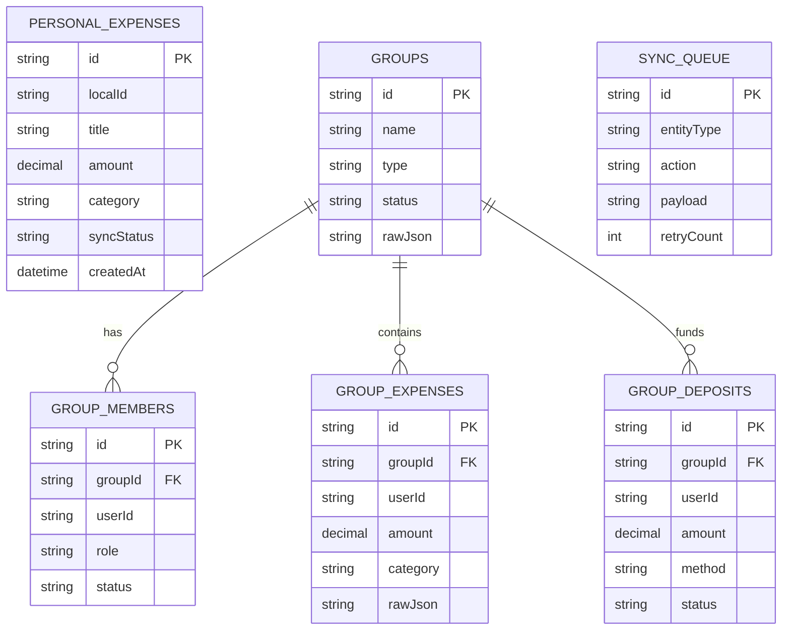
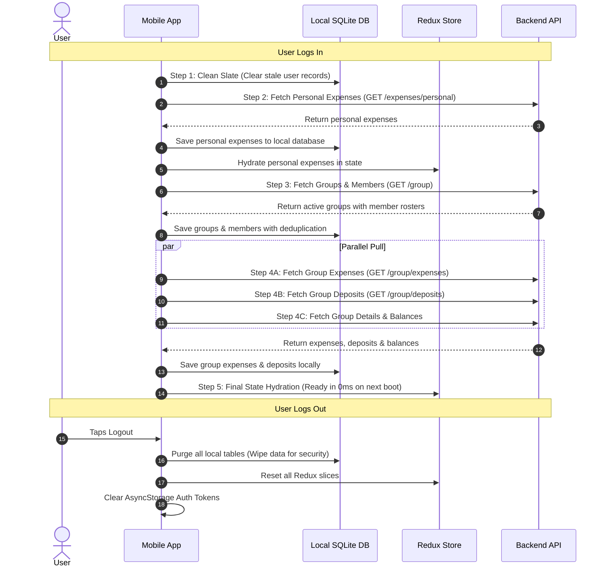

<div align="center">

# 📱 KotoGelo Mobile Client
### *Ultra-Fast, Offline-First Personal & Shared Group Expense Tracker*

[](https://reactnative.dev/)
[](https://expo.dev/)
[](https://www.typescriptlang.org/)
[](https://docs.expo.dev/versions/latest/sdk/sqlite/)
[](https://redux.js.org/)
[](https://developer.android.com/)
[](https://developer.apple.com/ios/)
[](#)

<p align="center">
  <b>KotoGelo Mobile</b> (কত গেলো) is an enterprise-grade, offline-first mobile application built with React Native and Expo. It delivers instant 0ms data loading via local SQLite storage, seamless background delta synchronization, personal budgeting, roommate flat fund management, mess accounting, multi-method deposits, and intelligent debt settlements.
</p>

---

</div>

## 📑 Table of Contents

- [🌟 Key Innovations & UX Architecture](#-key-innovations--ux-architecture)
- [🛠 Tech Stack & Core Dependencies](#-tech-stack--core-dependencies)
- [📂 Project Directory Structure](#-project-directory-structure)
- [🗃 Offline-First SQLite Architecture & Repositories](#-offline-first-sqlite-architecture--repositories)
- [🔄 5-Stage Auth & Background Sync Pipeline](#-5-stage-auth--background-sync-pipeline)
- [⚙️ Environment Configuration](#️-environment-configuration)
- [🚀 Quickstart & Development Guide](#-quickstart--development-guide)
- [📱 Screen Catalog & Application Flow](#-screen-catalog--application-flow)
- [🧮 Financial Calculation Engine (Client-Side)](#-financial-calculation-engine-client-side)
- [🎨 UI Components, Theming & Charting](#-ui-components-theming--charting)
- [🔧 Troubleshooting & Common Issues](#-troubleshooting--common-issues)
- [📄 License & Authors](#-license--authors)

---

## 🌟 Key Innovations & UX Architecture

- **0ms Instant SQLite Hydration:** Zero splash-screen wait time. Screens load pre-cached data instantly from the embedded SQLite database on mount before triggering lightweight background delta syncing.
- **5-Stage Full Auth-Sync Pipeline:** Clean slate on user logout (wiping all local personal and group database records) and a structured 5-stage parallel pull on user login.
- **Dual Expense Tracking Engine:** Seamless toggle between **Personal Daily Expenses** (wallet/card/bank) and **Collaborative Group Funds** (Roommates, Mess, Tours, Office, Friends).
- **Group Fund & Multi-Method Deposits:** Supports upfront group fund deposits via Cash, bKash, Nagad, Rocket, or Bank Transfer, maintaining transparent balance sheets for flatmates and tour members.
- **Fair Share & Debt Settlement Engine:** Dynamic calculation of individual expense shares (equal or custom splits) with automated debt simplification recommendations.
- **Offline Mutation Queue:** Allows users to log expenses, record deposits, and manage groups without internet connectivity; mutations are automatically queued and synchronized upon connection restoration.
- **Adaptive Visual Aesthetics:** Luxury Slate-900 hero balance cards, harmonious blue-green analytics charts, dynamic badges, and customizable categories with icon lookup.

---

## 🛠 Tech Stack & Core Dependencies

| Category | Library / Tool | Purpose |
| :--- | :--- | :--- |
| **Framework** | [React Native 0.81.5](https://reactnative.dev/) | Cross-platform native mobile application framework |
| **Tooling & Platform** | [Expo SDK 54](https://expo.dev/) | Managed runtime, dev tools, and native module integration |
| **Language** | [TypeScript 5.9+](https://www.typescriptlang.org/) | End-to-end static type safety |
| **Local Database** | [Expo SQLite 15.1+](https://docs.expo.dev/versions/latest/sdk/sqlite/) | Embedded relational storage for 0ms offline-first caching |
| **Key-Value Storage** | [@react-native-async-storage/async-storage](https://react-native-async-storage.github.io/async-storage/) | Token, session, and UI preference persistence |
| **State Management** | Redux & Custom React Hooks (`src/store`) | Centralized state store for user sessions and active transactions |
| **Vector Icons** | [@expo/vector-icons (Feather)](https://icons.expo.fyi/) | Crisp, modern UI iconography |
| **Safe Area Management** | [react-native-safe-area-context](https://github.com/th3rdwave/react-native-safe-area-context) | Dynamic viewport handling for notches, status bars & home bars |

---

## 📂 Project Directory Structure

```plaintext
kotogelo_frontend/
├── assets/                           # Application icon, splash screen, and images
├── src/
│   ├── components/                   # Reusable UI component library
│   │   ├── common/                   # Shared UI (HeroStatCard, ExpenseTableCard, DonutChart)
│   │   ├── dashboard/                # Summary cards, balance widgets, recent transactions
│   │   ├── expense/                  # Category icons, currency displays, amount inputs
│   │   ├── feedback/                 # ErrorMessage, EmptyState, OfflineBanner, Loading
│   │   ├── group/                    # GroupExpenseCard, GroupDepositCard, SettlementCard
│   │   │   └── tabs/                 # OverviewTab, DepositsTab, ExpensesTab, SettlementsTab, MembersTab
│   │   ├── layout/                   # Header, SafeArea, Screen wrapper
│   │   └── ui/                       # Atomic core (View, Text, TouchableOpacity, BottomSheet, Modal)
│   ├── config/                       # Runtime configuration & API endpoints
│   │   ├── api.ts                    # Centralized API endpoint registry
│   │   ├── env.ts                    # Environment variable parser
│   │   └── storage.ts                # Storage key constants
│   ├── constants/                    # Application constants (categories, colors, spacing)
│   ├── data/                         # Offline seeds & demo datasets
│   ├── navigation/                   # Navigation controllers & BottomTabBar
│   │   ├── AppNavigator.tsx          # Root screen switch & modal orchestration
│   │   └── BottomTabBar.tsx          # Custom animated floating bottom tab bar
│   ├── screens/                      # Application screens
│   │   ├── HomeScreen.tsx            # Main landing & dashboard
│   │   ├── DashboardScreen.tsx       # Personal overview & group share stats
│   │   ├── TransactionsScreen.tsx    # Unified transaction list (Personal & Group tabs)
│   │   ├── AddExpenseScreen.tsx      # Comprehensive expense creator (Personal / Group)
│   │   ├── GroupDetailsScreen.tsx    # Comprehensive group hub with 5 tabs
│   │   ├── GroupBalancesScreen.tsx   # Detailed group fund ledger & analytics
│   │   ├── GroupsScreen.tsx          # My groups catalog & management
│   │   ├── ExpenseAnalyticsScreenNew.tsx # Visual analytics & period breakdowns
│   │   ├── ProfileScreen.tsx         # User profile, statistics & logout
│   │   ├── LoginScreen.tsx           # Authentication sign-in
│   │   └── RegisterScreen.tsx        # New user registration
│   ├── services/                     # Business logic & API communication
│   │   ├── authService.ts            # Authentication network service
│   │   ├── expenseService.ts         # Personal expense network client
│   │   ├── groupService.ts           # Group expenses, deposits, balances & settlements
│   │   ├── expenseSyncService.ts     # 5-stage cloud-to-SQLite sync engine
│   │   ├── localExpenseService.ts    # SQLite interface for personal expenses
│   │   ├── localGroupService.ts      # SQLite interface & offline balance calculator
│   │   └── database/                 # SQLite database adapter & repositories
│   │       ├── database.ts           # Database initialization & migrations
│   │       ├── sqliteAdapter.ts      # Low-level SQLite execute & query adapter
│   │       └── repositories/         # Typed data repositories
│   │           ├── expense.repository.ts
│   │           ├── group.repository.ts
│   │           ├── groupDeposit.repository.ts
│   │           ├── groupExpense.repository.ts
│   │           ├── invitation.repository.ts
│   │           └── sync.repository.ts
│   ├── store/                        # Redux store, auth slices, expense slices & custom hooks
│   ├── theme/                        # Theme colors, styling tokens & elevation
│   ├── types/                        # Global TypeScript interfaces & models
│   └── utils/                        # Date formatting, currency formatting & math helpers
├── App.tsx                           # Application root component
├── app.json                          # Expo configuration & manifest
├── package.json
├── tsconfig.json
└── README.md
```

---

## 🗃 Offline-First SQLite Architecture & Repositories

KotoGelo utilizes a dedicated local relational database schema managed by `expo-sqlite`:



### Repositories Overview (`src/services/database/repositories/`)
1. **`expense.repository.ts`:** Manages local personal expenses, pending sync states, and categories.
2. **`group.repository.ts`:** Persists group metadata, member rosters (with deduplication guards), and ownership.
3. **`groupDeposit.repository.ts`:** Stores advance deposits, contributor information, and payment methods.
4. **`groupExpense.repository.ts`:** Caches shared group expenditures and participant share allocations.
5. **`invitation.repository.ts`:** Caches active invitations and join requests.
6. **`sync.repository.ts`:** Manages the offline mutation sync queue.

---

## 🔄 5-Stage Auth & Background Sync Pipeline

Managed by `expenseSyncService.ts`, the application maintains a strict lifecycle during authentication:



---

## ⚙️ Environment Configuration

Create a `.env` file in the root directory (matching `.env.example`):

```bash
cp .env.example .env
```

| Variable | Required | Default | Description |
| :--- | :---: | :--- | :--- |
| `EXPO_PUBLIC_API_BASE_URL` | ✅ | `https://koto-gelo-backend.vercel.app/api/v1` | Target backend API engine endpoint |
| `EXPO_PUBLIC_API_TIMEOUT` | ❌ | `15000` | HTTP network request timeout in milliseconds |
| `EXPO_PUBLIC_APP_ENV` | ❌ | `development` | Environment mode (`development`, `production`) |
| `EXPO_PUBLIC_APP_NAME` | ❌ | `KotoGelo` | Mobile application brand name |
| `EXPO_PUBLIC_APP_VERSION` | ❌ | `1.0.0` | Client application version string |

> **⚠️ Android Local Testing Note:**
> - When running on the **Android Emulator**, use `http://10.0.2.2:5000/api/v1` to point to `localhost:5000`.
> - When running on a **Physical Android Device**, use your computer's local Wi-Fi IP (e.g. `http://192.168.0.105:5000/api/v1`).

---

## 🚀 Quickstart & Development Guide

### Prerequisites
- [Node.js](https://nodejs.org/) (v22.x or later recommended)
- [pnpm](https://pnpm.io/) or `npm`
- [Expo CLI](https://docs.expo.dev/get-started/installation/) (`npx expo`)
- [Android Studio](https://developer.android.com/studio) (for Android Emulator) or Expo Go app on a physical device

### 1. Install Dependencies
```bash
cd kotogelo_frontend
npm install
```

### 2. Start Expo Metro Bundler
```bash
# Start Metro bundler with cache reset
npx expo start -c
```

### 3. Run on Target Platform
- **Android Device / Emulator:** Press `a` in the terminal or run `npm run android`.
- **iOS Simulator:** Press `i` in the terminal or run `npm run ios`.
- **Web Preview:** Press `w` in the terminal or run `npm run web`.

---

## 📱 Screen Catalog & Application Flow

```plaintext
                    ┌─────────────────────────┐
                    │     AppNavigator.tsx     │
                    └────────────┬────────────┘
                                 │
     ┌───────────────────────────┼───────────────────────────┐
     ▼                           ▼                           ▼
┌──────────────┐        ┌──────────────────┐        ┌─────────────────┐
│  Auth Stack  │        │   Main Tabs      │        │  Modals & Hubs  │
├──────────────┤        ├──────────────────┤        ├─────────────────┤
│ LoginScreen  │        │ HomeScreen       │        │ AddExpenseModal │
│ RegisterScrn │        │ TransactionsScrn │        │ AddDepositModal │
└──────────────┘        │ AddExpenseScreen │        │ InviteMemberMdl │
                        │ AnalyticsScreen  │        │ GroupDetails    │
                        │ ProfileScreen    │        │ GroupBalances   │
                        └──────────────────┘        └─────────────────┘
```

### 1. Home / Dashboard (`HomeScreen.tsx` & `DashboardScreen.tsx`)
- High-level net worth, personal spend versus group share summary card.
- Interactive donut chart for category spend distribution.
- Instant recent transactions feed with pull-to-refresh.

### 2. Transactions Hub (`TransactionsScreen.tsx`)
- **Personal Tab:** Filter by search, category, and time range (Today, Week, Month, All).
- **Group Tab:** Displays real-time **Group Fund Balance**, **Your Deposit**, and **Your Balance**, with clear attribution (`Group Fund (You)` / `Group Fund (@username)`).

### 3. Group Details & Management (`GroupDetailsScreen.tsx` & `GroupBalancesScreen.tsx`)
- **Overview Tab:** Luxury Slate-900 group balance card, surplus/deficit indicators, quick actions.
- **Deposits Tab:** Chronological deposit log with depositor initials, payment methods, and timestamps.
- **Expenses Tab:** Group expense log with category icons, recorder name, and participant counts.
- **Settlements Tab:** Optimal transfer recommendations to resolve all group debts with one tap.
- **Members Tab:** Member balance roster displaying individual deposits, expense shares, and net status.

### 4. Expense & Deposit Creation (`AddExpenseScreen.tsx`, `AddGroupDepositModal.tsx`)
- Smart category selector with visual emoji and icon indicators.
- Mode switcher: Personal Expense vs. Group Expense.
- Group fund toggle and multi-member participant split selectors.

---

## 🧮 Financial Calculation Engine (Client-Side)

### Group Fund Remaining Balance
$$\text{Group Fund Balance} = \sum_{d \in \text{Deposits}} \text{amount}_d - \sum_{e \in \text{Expenses}} \text{amount}_e$$

### Individual Member Net Share
$$\text{Member Net Balance} = \text{Total Deposited} - \text{Total Expense Share}$$

- If $\text{Net Balance} > 0$: **`+৳... (Refund Due)`** — Member has deposited more than their fair share.
- If $\text{Net Balance} < 0$: **`-৳... (To Pay)`** — Member's fair share exceeds their deposited amount.
- If $\text{Net Balance} = 0$: **`৳0 (Settled)`** — Member has completely squared their balance.

---

## 🎨 UI Components, Theming & Charting

### Harmonious Chart Color Palettes
The analytics and transaction dashboards utilize an eye-friendly, high-contrast palette:

| Token | Primary Color | Background Tint | Accent Bar |
| :--- | :---: | :---: | :---: |
| **Royal Blue** | `#2563EB` | `#EFF6FF` | `#3B82F6` |
| **Emerald Green** | `#059669` | `#ECFDF5` | `#10B981` |
| **Ocean Sky** | `#0284C7` | `#F0F9FF` | `#0EA5E9` |
| **Teal** | `#0D9488` | `#F0FDFA` | `#14B8A6` |
| **Indigo** | `#4F46E5` | `#EEF2FF` | `#6366F1` |
| **Rose Gold** | `#E11D48` | `#FFF1F2` | `#FB7185` |

---

## 🔧 Troubleshooting & Common Issues

### 1. Network Request Failed / Cannot Connect to Backend
- Make sure backend is running on `http://localhost:5000`.
- If testing on an Android device or emulator, verify `EXPO_PUBLIC_API_BASE_URL` in `.env` uses your machine's LAN IP or `10.0.2.2:5000` (not `localhost`).
- Restart Metro with cache cleared: `npx expo start -c`.

### 2. Clearing Local SQLite Database
- Triggering a **Logout** from the Profile screen automatically wipes all SQLite tables (`personal_expenses`, `groups`, `group_members`, `group_expenses`, `group_deposits`, `group_invitations`, `sync_queue`).
- Alternatively, reinstall the application to recreate the local SQLite file from scratch.

### 3. Duplicate Key Warnings in FlatList
- All list renderers and repositories enforce compound key deduplication (`${id || userId}_${index}`) to prevent React reconciliation warnings.

---

## 📄 License & Authors

- **Platform:** KotoGelo (কত গেলো)
- **Client Application:** KotoGelo Mobile Client (React Native + Expo)
- **License:** Proprietary / All Rights Reserved

<div align="center">
  <sub>Crafted with ❤️ for effortless personal budgeting and shared group expenses.</sub>
</div>
